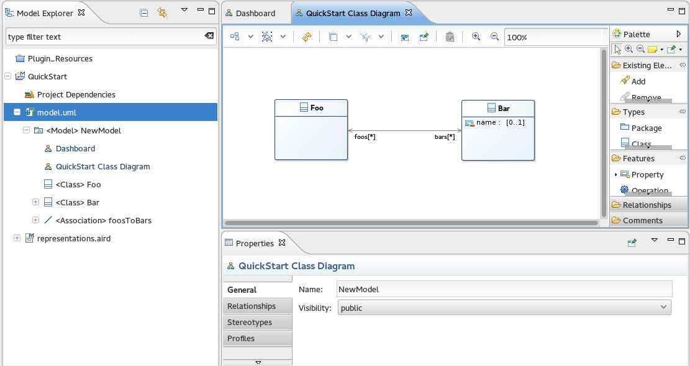
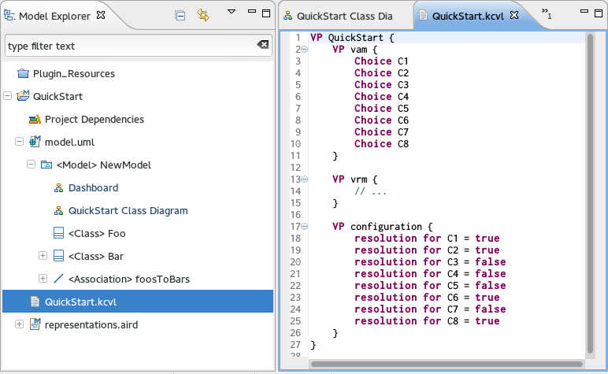
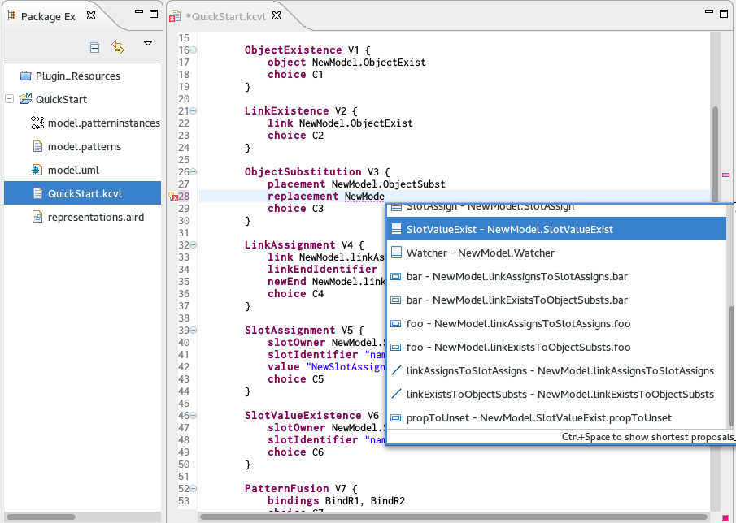
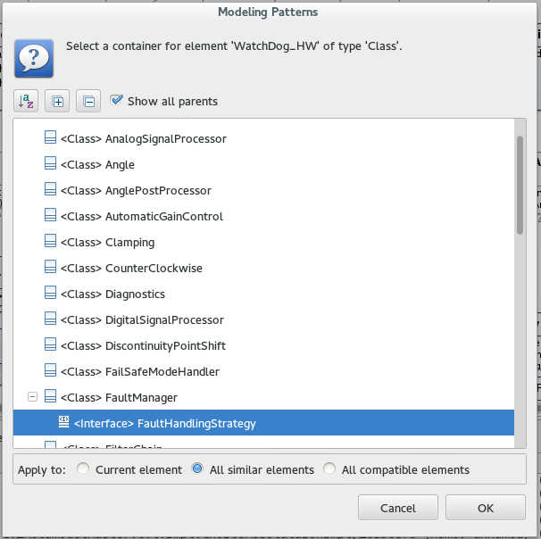

### KCVL
KCVL is a *prototype* implementation of the OMG [Common Variability Language](http://www.omgwiki.org/variability/doku.php) with several additional features. KCVL comes with a textual editor for expressing variability abstraction models, variability realization models and resolution models. Several services are built around this textual representation, including:

* The manipulation of base architecture models expressed in different formalisms such as [UML](http://marketplace.obeonetwork.com/module/uml), [EMF Ecore](http://www.eclipse.org/modeling/emf/) or [Capella](https://www.polarsys.org/proposals/capella). Any MOF-compliant language can be integrated with little effort
* An interpreter for deriving specific products architectures from a common base model
* A binding to [FAMILIAR](http://familiar-project.github.io/) for manipulating and reasoning about (multiple) feature models
* New variability realization concepts leveraging [EMF Diff/Merge](http://eclipse.org/diffmerge/) patterns mechanism

### Installation
KCVL is bundled as a set of Eclipse plugins.

#### Requirements

* Eclipse Juno (3.8/4.2)
* Xtext 2.3.1
* EMF Diff/Merge (including patterns tool)
* Sirius
* Groovy-Eclipse

#### Installation
_Help -> Install New Software..._

* [Update Site URL @ INRIA](https://ci.inria.fr/k3al/job/kcvl/lastSuccessfulBuild/artifact/fr.inria.diverse.kcvl.p2updatesite/target/site/)
* [Continous Integration @ INRIA](https://ci.inria.fr/k3al/job/kcvl/)

### Quick Start
In this quick start, we use UML Designer to design the common base model of different product variants. We express variability abstraction, realization and configuration in a KCVL file and derive some products using the interpreter.

A complete example can be found here: [https://github.com/diverse-project/kcvl/tree/master/Examples](https://github.com/diverse-project/kcvl/tree/master/Examples) 

#### Base Model Design
First, we create a new UML project with a simple class diagram:

1. Open the Modeling perspective
2. File -> New -> UML Project (project name: QuickStart)
3. '+' sign left to model.uml -> Right-click '<Model> NewModel' -> New Representation -> NewModel Class Diagram
4. Design a class diagram using the graphical modeler


#### KCVL file
KCVL file are expressed in a formalism as close as possible to the CVL formalism. The [CVL wiki](http://www.omgwiki.org/variability/doku.php) lists the different constructs available for expressing variability. KCVL files are composed of three main parts:

* A variability abstraction model (VAM) that expresses the feature model of the different variants
* A variability realization model (VRM) that specifies in which way the base model is affected by the selection of features
* A resolution model (RM) that allows to configure a feature model by selecting specific features corresponding to a given product

We create a new KCVL file in the QuickStart project (File -> New File -> QuickStart.kcvl).



#### Variability Abstraction Model
Below is an example feature model expressed in KCVL:

```
VP vam {
	Choice Blog { // Root feature
		implied // Blog is mandatory and automatically selected
		
		Choice Logging // Optional feature
		Choice Stylesheet { implied } // Mandatory feature

		Choice Database[1..1] { // XOR tree (one and only one feature of the subtree)
			Choice PostgreSQL
			Choice MySQL
		}
	}
	// OCL implication constraint: Logging mechanism requires a Database
	constraint implies(Logging, Database) on Blog
}
```

#### Variability Realization Model
The following listing illustrates the different variation points currently supported in KCVL. Each variation point describes the modification of the base model implied by the selection of one (or more) features. Any UML/Ecore/Capella/MOF-compliant model can be imported and supported with autocompletion.

```
VP vrm {
	import "model.uml" // Import all model elements
	
	// If C1 is NOT selected
	// ObjectExist class will be removed
	ObjectExistence V1 {
		object NewModel.ObjectExist
		choice C1
	}

	// If C2 is NOT selected
	// the ownedEnd "foo" of the association
	// linkExistsToObjectSubsts will be removed
	LinkExistence V2 {
		link NewModel.linkExistsToObjectSubsts.foo
		choice C2
	}

	// If C3 is selected
	// ObjectSubst class will be replaced
	// with Watcher class
	ObjectSubstitution V3 {
		placement NewModel.ObjectSubst
		replacement NewModel.Watcher
		choice C3
	}

	// If C4 is selected
	// the ownedEnd "foo" of the association
	// linkAssignsToSlotAssigns will be replaced
	// with the ownedEnd "bar" 
	LinkAssignment V4 {
		link NewModel.linkAssignsToSlotAssigns.foo
		linkEndIdentifier "ownedEnd"
		newEnd NewModel.linkAssignsToSlotAssigns.bar
		choice C4
	}

	// If C5 is selected
	// The attribute "name" of the class SlotAssign
	// will be set to "NewSlotAssignmentName"
	SlotAssignment V5 {
		slotOwner NewModel.SlotAssign
		slotIdentifier "name"
		value "NewSlotAssignmentName"
		choice C5
	}

	// If C6 is NOT selected
	// The attribute "name" of the property
	// "propToUnset" of the class SlotValueExist
	// will be unsetted (if possible) or set to null
	SlotValueExistence V6 {
		slotOwner NewModel.SlotValueExist.propToUnset
		slotIdentifier "name"
		choice C6
	}

	// If C7 is selected
	// Pattern will be applied with the two
	// referenced role bindings
	PatternFusion V7 {
		bindings BindR1, BindR2
		choice C7
	}

	// Bind the role "R1" to the class PatternFusionTest
	RoleBinding BindR1 {
		role "/QuickStart/model.patterns#_JUYycF3HEeSsLt1m8WuECQ"
		target NewModel.PatternFusionTest
	}

	// Bind the role "R2" to the class Watcher
	RoleBinding BindR2 {
		role "/QuickStart/model.patterns#_JrnmsF3HEeSsLt1m8WuECQ"
		target NewModel.Watcher
	}
	
	PatternIntegration V8 {
		bindings BindR1_1, BindR2_2
		choice C8
	}
	
	RoleBinding BindR1_1 {
		role "/QuickStart/model.patterns#_JUYycF3HEeSsLt1m8WuECQ"
		target NewModel.PatternIntegrationTest
	}
	
	RoleBinding BindR2_2 {
		role "/QuickStart/model.patterns#_JrnmsF3HEeSsLt1m8WuECQ"
		target NewModel.Watcher
	}
}
```

Elements of the base model can be referenced in three different ways:

* By their name, using Ctrl-Click autocompletion (see below)
* By their ID, e.g. ```object "/QuickStart/model.uml#_2GQ-4F1REeSqzeBJjpaeLQ"```
* Using the containment tree, e.g. ```object "/QuickStart/model.uml#//@packagedElement.0/@ownedAttribute.0"```



#### Resolution Model
The resolution model defines which features are selected in the target product, and which ones are not. Below is a simple example:

```
VP configuration {
	resolution for C1 = true
	resolution for C2 = true
	resolution for C3 = false
	resolution for C4 = false
	resolution for C5 = false
	resolution for C6 = true
	resolution for C7 = false
	resolution for C8 = true
}
```

#### FAMILIAR report
FAMILIAR report can be triggered by right-clicking a KCVL file -> KCVL -> FAMILIAR Report. Output of FAMILIAR is displayed in the console view:

```
--------------------------------------------------------------------
Valid model = true
Number of valid configurations = 4942080.0
Choices that cannot be selected = []
Automatically selected choices = [DSP, ADC, SafetyElements, XZAngleCalculation, Root, SelfCorrection, CorrectionOverGain, XYAngleCalculation, MLX90365, YZAngleCalculation, ASP, AngleMeasurement]
--------------------------------------------------------------------
```

#### CVL Derivation
The derivation of the target product model can be triggered by right-clicking a KCVL file -> KCVL -> Derive Product. A new model will be created in the project folder (e.g. model_new.uml) with the appropriate features depending on the configuration in the KCVL resolution model. A .cvl variability model conforming to the CVL metamodel will also be created in the same project.

If the VRM requires the insertion of patterns in the base model, a dialog box is opened during the derivation asking for the containers of new elements inserted by the pattern:



### Additional Notes

* Currently, resolution models are not checked against constraints of the VAM
* Synchronization between Xtext and Sirius only happens at save-time. If you don't see new elements of your model in the KCVL file, try saving the UML model and reopen the KCVL file

